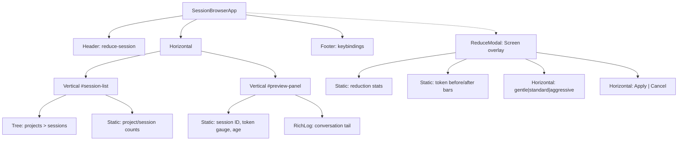

# Session Browser TUI Design Spec

## Overview

A textual-based TUI for browsing Claude Code sessions across all projects, previewing conversation tails, and running reductions with a visual modal overlay. Launched via `reduce-session` (no args) or `reduce-session --browse`.

## Layout

Split-panel layout: left tree for project/session navigation, right pane for conversation preview.

```
┌─ reduce-session ─────────────────────────────────────────────────────────┐
│ Projects & Sessions                  │ Session Preview                   │
│──────────────────────────────────────│───────────────────────────────────│
│ ripvec/                              │ db776eab  ~950k tok  4d ago      │
│   ▸ db776eab  ~950k tok  4d  ◀──    │ ▓▓▓▓▓▓▓▓▓░  950k/1M             │
│     4c497bb0    ~82k tok  8d         │───────────────────────────────────│
│     4e33f80a     ~5k tok  14d        │ user: Yeah I'm excited about WS5 │
│ tracemeld/                           │                                   │
│   ▸ 8052103f  ~210k tok  5d         │ assistant: Great! Let me start    │
│ ShopifyQuickbooksBridge/             │   by reviewing the WS5 plan...   │
│   ▸ a3f2e91b   ~45k tok  12d        │                                   │
│                                      │ [Bash: cargo build] -> ok        │
│                                      │ [Edit: src/metal.rs] -> 38 lines │
│                                      │                                   │
│                                      │ user: Should we see any value    │
│                                      │       from T1/6?                  │
│──────────────────────────────────────│───────────────────────────────────│
│ 4 projects  12 sessions             │ [r]educe  [d]ry-run  [h]istory   │
└──────────────────────────────────────────────────────────────────────────┘
```

### Widget Hierarchy



## Session Discovery

### Scanning

Scan `~/.claude/projects/*/` for `*.jsonl` files:
- Skip files ending in `.bak`, `.bak2`, `.reduced`
- Skip continuation files (`UUID.TIMESTAMP.jsonl`) — group them with their parent session
- Derive project name from directory slug: `-Users-rwaugh-src-mine-ripvec` → last path component → `ripvec`
- Session short ID: first 8 chars of the UUID filename

### Per-Session Metadata (quick-read from tail)

Read only the last ~50KB of each file to extract:
- **Token estimate**: from last `message.usage` (`input_tokens + cache_read_input_tokens + cache_creation_input_tokens`)
- **Last timestamp**: for age calculation
- **Last few exchanges**: user prompts, assistant text, tool call summaries (for preview)
- **Line count**: from file (count newlines without parsing every line)

If no `message.usage` exists (already stripped), fall back to heuristic: `file_size_bytes / 14` as rough token estimate (calibrated from our observations: ~5.4 chars/token on content, but content is ~40% of file).

### Data Model

```python
@dataclass
class SessionInfo:
    path: Path
    project_name: str
    session_id: str        # full UUID
    short_id: str          # first 8 chars
    size_bytes: int
    token_estimate: int    # from usage or heuristic
    last_timestamp: datetime
    age_display: str       # "4h", "2d", "14d"
    line_count: int
    continuation_files: list[Path]  # grouped UUID.TIMESTAMP.jsonl files
    has_git: bool          # project dir has .git
    last_exchanges: list[Exchange]  # for preview

@dataclass
class Exchange:
    role: str              # "user", "assistant", "tool"
    text: str              # display text
    tool_name: str | None  # for tool summaries
    tool_status: str | None  # "ok", "error", exit code
    is_error: bool
```

## Preview Pane

### Conversation Rendering

Extract last ~15 meaningful exchanges from the session tail. For each JSONL line in the tail:

| Message type | Rendering |
|---|---|
| User text prompt | Cyan `user:` prefix, full text |
| Assistant text block | Amber `assistant:` prefix, full text |
| Tool use (Bash) | Dim `[Bash: <command truncated to 60ch>]` |
| Tool result (success) | Dim `-> <first line or "ok">` appended to tool use |
| Tool result (error) | Red `-> error: <first line>` |
| Tool use (Read/Edit/Write) | Dim `[Read: <file_path>] -> <line_count> lines` or `[Edit: <file_path>] -> <n> lines changed` |
| Tool use (Agent) | Dim `[Agent: <description>]` |
| Tool use (MCP) | Dim `[<mcp_tool_short_name>]` |
| progress, system, file-history-snapshot | Skip entirely |
| Thinking blocks | Skip (not user-facing) |

### Info Bar

Above the conversation log, a one-line metadata bar:

```
db776eab  ~950k tokens  4 days ago  16.5 MB  10,426 lines
▓▓▓▓▓▓▓▓▓░  950k / 1M context
```

Token gauge color: green (< 200k), yellow (200-500k), orange (500-800k), red (> 800k).

## Health Indicators

In the session tree, each session node shows:

```
db776eab  ~950k tok  4d  ●
```

Where the dot is colored by token pressure (green/yellow/orange/red). Age is dimmed for sessions older than 7 days.

Sorting: newest first within each project. Projects sorted alphabetically.

## Reduce Modal

Pressing `r` on a selected session opens a full-screen modal overlay.

### Modal Layout

```
┌─ Reduce: db776eab (ripvec) ──────────────────────────────────────────────┐
│                                                                          │
│  Profile: [gentle] [■ standard] [aggressive]    Cut: 50%  Fade: 75%     │
│                                                                          │
│  ── Dry Run Results ─────────────────────────────────────────────────    │
│                                                                          │
│  Original:  10,426 lines   16.5 MB                                       │
│  Reduced:    9,180 lines   13.5 MB                                       │
│  Saved:      1,246 lines    3.0 MB  (18%)                               │
│                                                                          │
│  ── Token Estimate ──────────────────────────────────────────────────    │
│                                                                          │
│  Before: ▓▓▓▓▓▓▓▓▓░░░░░░░░░░░  950k (calibrated from API)              │
│  After:  ▓▓▓▓▓▓▓░░░░░░░░░░░░░  780k                                    │
│                                                                          │
│  ── Strategies Applied ──────────────────────────────────────────────    │
│                                                                          │
│  progress dropped        1,173    stale reads trimmed      267           │
│  thinking removed          107    user prompts trimmed      37           │
│  system deduped              28    duplicate blocks           11          │
│  reparented                  16                                           │
│                                                                          │
│  ── Safety ──────────────────────────────────────────────────────────    │
│                                                                          │
│  ✓ parentUuid chain intact (0 new breaks)                                │
│  ✓ git repo initialized                                                  │
│  ✓ .bak safety net will be created                                       │
│                                                                          │
│                                    [ Apply ]    [ Cancel ]               │
│                                                                          │
└──────────────────────────────────────────────────────────────────────────┘
```

### Modal Behavior

1. On open: immediately runs the reduction pipeline in-process with `--dry-run` semantics using `standard` profile
2. Profile buttons re-run the pipeline when clicked/pressed (g/s/a keys)
3. Results update in-place
4. **Apply**: calls `do_apply()` (git snapshot + .bak + replace), shows success message, refreshes session list
5. **Cancel**: discards the `.reduced` file, returns to browser
6. Staleness check: if the session file's mtime changed since the modal opened, show a warning and refuse to apply

### History Sub-Modal

Pressing `h` on a session shows reduction history (from git tags) in a simpler modal:

```
┌─ History: db776eab ──────────────────────────────────────────────────────┐
│                                                                          │
│  2026-03-23 08:11  standard cut=50 fade=75                              │
│    23.4 MB → 12.0 MB  (49% saved)                                       │
│                                                                          │
│  2026-03-23 19:03  standard cut=50 fade=75                              │
│    16.5 MB → 13.5 MB  (18% saved)                                       │
│                                                                          │
│  2 reductions. Current: 13.5 MB                                          │
│                                                                          │
│  [r]estore to pre-reduction    [Esc] close                              │
└──────────────────────────────────────────────────────────────────────────┘
```

## Key Bindings

| Key | Context | Action |
|---|---|---|
| `↑`/`↓` or `j`/`k` | Tree | Navigate sessions |
| `Enter` | Tree (project node) | Expand/collapse project |
| `Enter` or `r` | Tree (session node) | Open reduce modal |
| `d` | Tree (session node) | Open reduce modal in read-only mode (no Apply) |
| `i` | Tree (session node) | Init git repo for that project |
| `h` | Tree (session node) | Show reduction history |
| `R` | Global | Refresh session list |
| `q` | Global | Quit |
| `Esc` | Modal | Close modal |
| `g`/`s`/`a` | Reduce modal | Switch profile (gentle/standard/aggressive) |
| `Enter` | Reduce modal | Apply |

## Module Structure

```
src/reduce_session/
    __init__.py
    cli.py              # existing CLI entry point (unchanged)
    tui.py              # SessionBrowserApp, main TUI
    session.py          # SessionInfo discovery, tail parsing, Exchange extraction
    widgets.py          # TokenGauge, ConversationPreview, ReduceModal, HistoryModal
    reduction.py        # extracted reduction pipeline (refactored from cli.py)
    styles.tcss         # textual CSS stylesheet
```

### Refactoring cli.py

The reduction pipeline logic (passes 1-5: build maps, drop/reparent, cross-message intelligence, position-aware trimming, orphan repair) needs to be callable from both the CLI and the TUI modal. Extract into `reduction.py`:

```python
# reduction.py
@dataclass
class ReductionResult:
    kept_lines: list[str]
    stats: dict[str, int]
    orig_count: int
    orig_size: int
    new_count: int
    new_size: int
    token_budget: TokenBudget | None

def reduce_session(
    input_path: str,
    profile: str = "standard",
    cut: int = 50,
    fade: int = 75,
    estimate_tokens: bool = False,
    chars_per_token: float = 3.7,
) -> ReductionResult:
    """Run the full reduction pipeline and return results without writing."""
    ...
```

`cli.py` calls `reduce_session()` then handles output/apply/restore. `widgets.py` calls `reduce_session()` in a worker thread to keep the TUI responsive.

### Entry Points

```toml
[project.scripts]
reduce-session = "reduce_session.cli:main"
```

Update `cli.py` `parse_args()`: when invoked with no args, launch the TUI instead of erroring. Add `--browse` as an explicit flag too.

## Dependencies

```toml
dependencies = ["textual>=1.0"]
```

## Visual Design Notes

- Dark theme default (textual's dark mode) — these are terminal users
- Token gauges use textual's `ProgressBar` or custom `Static` with Rich markup for colored block chars (▓░)
- Conversation preview uses Rich markup for role colors (cyan user, amber assistant, dim tool calls, red errors)
- Modal uses textual `Screen` with semi-transparent background overlay
- Tree uses textual `Tree` widget with custom node rendering for session metadata
- Aim for striking: the token gauge and reduction before/after bars should be the visual anchors
