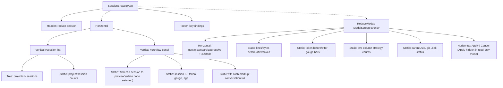

# Session Browser TUI Design Spec

## Overview

A textual-based TUI for browsing Claude Code sessions across all projects, previewing conversation tails, and running reductions with a visual modal overlay. Launched via `reduce-session` (no args) or `reduce-session --browse`.

## Layout

Split-panel layout: left tree for project/session navigation, right pane for conversation preview.

```
┌─ reduce-session ─────────────────────────────────────────────────────────┐
│ Projects & Sessions                  │ Session Preview                   │
│──────────────────────────────────────│───────────────────────────────────│
│ ripvec/                              │ db776eab  ~950k tok  4d ago      │
│   ▸ db776eab  ~950k tok  4d  ◀──    │ ▓▓▓▓▓▓▓▓▓░  950k/1M             │
│     4c497bb0    ~82k tok  8d         │───────────────────────────────────│
│     4e33f80a     ~5k tok  14d        │ user: Yeah I'm excited about WS5 │
│ tracemeld/                           │                                   │
│   ▸ 8052103f  ~210k tok  5d         │ assistant: Great! Let me start    │
│ ShopifyQuickbooksBridge/             │   by reviewing the WS5 plan...   │
│   ▸ a3f2e91b   ~45k tok  12d        │                                   │
│                                      │ [Bash: cargo build] -> ok        │
│                                      │ [Edit: src/metal.rs] -> 38 lines │
│                                      │                                   │
│                                      │ user: Should we see any value    │
│                                      │       from T1/6?                  │
│──────────────────────────────────────│───────────────────────────────────│
│ 4 projects  12 sessions             │ [r]educe  [d]ry-run  [h]istory   │
└──────────────────────────────────────────────────────────────────────────┘
```

### Widget Hierarchy



## Session Discovery

### Scanning

Scan `~/.claude/projects/*/` for `*.jsonl` files:
- Skip files ending in `.bak`, `.bak2`, `.reduced`
- Identify continuation files by pattern: `UUID.TIMESTAMP.jsonl` (UUID followed by a dot and digits). Group them with their parent `UUID.jsonl`. The main file is the one without a timestamp suffix.
- Derive project name from directory slug: split on `-`, reverse-map to path segments, take the last meaningful component. If two projects share the same leaf name, include the parent: `work/api`, `personal/api`.
- Session short ID: first 8 chars of the UUID filename

### Error Handling

Session discovery wraps all I/O in try/except:
- `PermissionError` on directory listing: skip the project, log a warning
- `json.JSONDecodeError` on tail parsing: mark the session with `parse_error=True`, show a warning indicator in the tree, still show file size/age
- Zero-byte files: skip entirely
- Truncated JSON lines (active session being written to): the tail reader already handles partial first lines by discarding them (seek to offset, skip to next newline)

### Continuation Files (v1 behavior)

For v1, the reduce modal operates on **the main session file only**. If continuation files exist, show an info note in the modal: "This session has N continuation file(s). Reduction applies to the main file only." Reducing all files is a v2 feature.

### Per-Session Metadata (quick-read from tail)

Read only the last ~50KB of each file to extract:
- **Token estimate**: from last `message.usage` (`input_tokens + cache_read_input_tokens + cache_creation_input_tokens`)
- **Last timestamp**: for age calculation
- **Last few exchanges**: user prompts, assistant text, tool call summaries (for preview)
- **Line count**: from file (count newlines without parsing every line)

If no `message.usage` exists (already stripped), fall back to heuristic: `file_size_bytes / 14` as rough token estimate (calibrated from our observations: ~5.4 chars/token on content, but content is ~40% of file).

### Data Model

```python
@dataclass
class SessionInfo:
    path: Path
    project_name: str
    session_id: str        # full UUID
    short_id: str          # first 8 chars
    size_bytes: int
    token_estimate: int    # from usage or heuristic
    last_timestamp: datetime | None
    age_display: str       # "4h", "2d", "14d"
    line_count: int
    continuation_files: list[Path]  # grouped UUID.TIMESTAMP.jsonl files
    last_exchanges: list[Exchange]  # for preview
    parse_error: bool      # True if tail parsing failed

@dataclass
class Exchange:
    role: str              # "user", "assistant", "tool"
    text: str              # display text
    tool_name: str | None  # for tool summaries
    tool_status: str | None  # "ok", "error", exit code
    is_error: bool
```

## Preview Pane

### Conversation Rendering

Extract last ~15 meaningful exchanges from the session tail. For each JSONL line in the tail:

| Message type | Rendering |
|---|---|
| User text prompt | Cyan `user:` prefix, full text |
| Assistant text block | Amber `assistant:` prefix, full text |
| Tool use (Bash) | Dim `[Bash: <command truncated to 60ch>]` |
| Tool result (success) | Dim `-> <first line or "ok">` appended to tool use |
| Tool result (error) | Red `-> error: <first line>` |
| Tool use (Read/Edit/Write) | Dim `[Read: <file_path>] -> <line_count> lines` or `[Edit: <file_path>] -> <n> lines changed` |
| Tool use (Agent) | Dim `[Agent: <description>]` |
| Tool use (MCP) | Dim `[<mcp_tool_short_name>]` |
| progress, system, file-history-snapshot | Skip entirely |
| Thinking blocks | Skip (not user-facing) |

### Empty State

When no session is selected (app launch, project node highlighted), the preview pane shows:

```
Select a session to preview its conversation
```

Centered, dimmed, with a subtle hint about keybindings.

### Info Bar

Above the conversation log, a two-line metadata bar:

```
db776eab  ~950k tokens  4 days ago  16.5 MB  10,426 lines
▓▓▓▓▓▓▓▓▓░  950k / 1M context
```

Token gauge color: green (< 200k), yellow (200-500k), orange (500-800k), red (> 800k).

The conversation preview uses a `Static` widget with Rich markup (not `RichLog`) to avoid append-only flicker. On session change, re-render the entire widget content.

## Health Indicators

In the session tree, each session node shows:

```
db776eab  ~950k tok  4d  ●
```

Where the dot is colored by token pressure (green/yellow/orange/red). Age is dimmed for sessions older than 7 days. Sessions with `parse_error=True` show a `⚠` instead.

Sorting: newest first within each project. Projects sorted alphabetically.

## Reduce Modal

Pressing `r` on a selected session opens a modal screen overlay (textual `ModalScreen`).

### Modal Layout

```
┌─ Reduce: db776eab (ripvec) ──────────────────────────────────────────────┐
│                                                                          │
│  Profile: [gentle] [■ standard] [aggressive]    Cut: 50%  Fade: 75%     │
│                                                                          │
│  ── Dry Run Results ─────────────────────────────────────────────────    │
│                                                                          │
│  Original:  10,426 lines   16.5 MB                                       │
│  Reduced:    9,180 lines   13.5 MB                                       │
│  Saved:      1,246 lines    3.0 MB  (18%)                               │
│                                                                          │
│  ── Token Estimate ──────────────────────────────────────────────────    │
│                                                                          │
│  Before: ▓▓▓▓▓▓▓▓▓░░░░░░░░░░░  950k (calibrated from API)              │
│  After:  ▓▓▓▓▓▓▓░░░░░░░░░░░░░  780k                                    │
│                                                                          │
│  ── Strategies Applied ──────────────────────────────────────────────    │
│                                                                          │
│  progress dropped        1,173    stale reads trimmed      267           │
│  thinking removed          107    user prompts trimmed      37           │
│  system deduped              28    duplicate blocks           11          │
│  reparented                  16                                           │
│                                                                          │
│  ── Safety ──────────────────────────────────────────────────────────    │
│                                                                          │
│  ✓ parentUuid chain intact (0 new breaks)                                │
│  ✓ git repo initialized                                                  │
│  ✓ .bak safety net will be created                                       │
│                                                                          │
│                                    [ Apply ]    [ Cancel ]               │
│                                                                          │
└──────────────────────────────────────────────────────────────────────────┘
```

### Modal Behavior

1. On open: capture the file's mtime, then run the reduction pipeline in a textual Worker (`self.run_worker()`) with `standard` profile
2. While running: show a spinner/loading indicator
3. On completion: `Worker.StateChanged` handler updates all modal widgets on the main thread
4. Profile buttons (g/s/a keys) **cancel** the in-flight worker before starting a new one, to prevent memory buildup from concurrent reductions on large files
5. Results update in-place when the new worker completes
6. **Apply**: check mtime hasn't changed since step 1. If changed, show warning and refuse. Otherwise call `do_apply()` (git snapshot + .bak + replace), show success message, dismiss modal, refresh session list.
7. **Cancel**: discard the `.reduced` file if it exists, dismiss modal
8. **Read-only mode** (`d` keybinding): same modal but Apply button is hidden. Only Cancel/Esc available.

### Staleness Check

Capture `os.path.getmtime(path)` at worker start (not modal open), check at apply time. If the file changed between worker-start and apply, the reduction was computed against stale data. Show: "Session file was modified since analysis. Re-run reduction first."

## Key Bindings

| Key | Context | Action |
|---|---|---|
| `↑`/`↓` or `j`/`k` | Tree | Navigate sessions |
| `Enter` | Tree (project node) | Expand/collapse project |
| `Enter` or `r` | Tree (session node) | Open reduce modal |
| `d` | Tree (session node) | Open reduce modal in read-only mode (no Apply) |
| `h` | Tree (session node) | Show reduction history (v2 — for now print to status bar) |
| `i` | Tree (session node) | Init git repo for that project |
| `R` | Global | Refresh session list |
| `q` | Global | Quit |
| `Esc` | Modal | Close modal |
| `g`/`s`/`a` | Reduce modal | Switch profile (gentle/standard/aggressive) |
| `Enter` | Reduce modal | Apply (if not read-only) |

## Module Structure

```
src/reduce_session/
    __init__.py
    cli.py              # CLI entry point: parse_args, main, do_init/apply/restore/history
    tui.py              # SessionBrowserApp, screen composition
    session.py          # SessionInfo discovery, tail parsing, Exchange extraction
    widgets.py          # TokenGauge, ConversationPreview, ReduceModal
    reduction.py        # reduction pipeline + ReductionResult + TokenBudget + PROFILES
    git_ops.py          # git preservation: ensure_git_repo, git_snapshot, restore, tags, history
    styles.tcss         # textual CSS stylesheet
```

### Module Boundaries

**`reduction.py`** — everything needed to run a reduction:
- `PROFILES` dict
- `CHARS_PER_TOKEN`, `ENVELOPE_FIELDS`
- `TokenBudget` class
- All helper functions: `truncate`, `trim_string`, `strip_shell_banners`, `strip_cargo_noise`, `clean_bash_text`, `get_content_blocks`, `text_of`, `get_msg_type`, `is_droppable_line`
- All detection functions: `detect_stale_reads`, `detect_duplicate_blocks`, `detect_error_retries`, `dedup_system_reminders`, `detect_constant_envelope_fields`, `fix_orphaned_tool_results`
- All trimming functions: `make_aggressiveness_fn`, `blended_limit`, `trim_tool_result`, `trim_toolUseResult`
- `extract_last_usage()`
- `reduce_session()` orchestrator → `ReductionResult`

```python
@dataclass
class ReductionResult:
    kept_lines: list[str]
    stats: dict[str, int]
    orig_count: int
    orig_size: int
    new_count: int
    new_size: int
    orig_budget: TokenBudget | None   # token estimate of original
    reduced_budget: TokenBudget | None  # token estimate after reduction
    api_tokens: int | None            # from last message.usage (for calibration)
```

**`git_ops.py`** — all git operations (used by both cli.py and widgets.py):
- `GITIGNORE_CONTENT`
- `_run_git`, `ensure_git_repo`, `_write_gitignore`, `_update_gitignore`
- `git_snapshot`, `git_restore_from_tag`
- `session_short_id`, `make_tag`, `get_reduction_tags`, `get_tag_file_size`
- `do_init`, `do_apply`, `do_restore`, `do_history`, `find_backups`

**`cli.py`** — CLI-only concerns:
- `parse_args()` (updated: no args launches TUI, `--browse` explicit flag)
- `main()` — dispatches to TUI or CLI reduction/apply/restore/init/history
- Imports from `reduction` and `git_ops`

**`session.py`** — session discovery (used by TUI):
- `SessionInfo`, `Exchange` dataclasses
- `scan_projects()` → `list[SessionInfo]`
- `parse_tail()` → extracts exchanges, token estimate, timestamp from tail
- `format_age()` → "4h", "2d", "14d"

**`tui.py`** — app composition (used by cli.py when no args):
- `SessionBrowserApp` — mounts Header, Horizontal(tree, preview), Footer
- Key binding handlers
- `on_tree_node_highlighted` → updates preview pane

**`widgets.py`** — custom widgets (used by tui.py):
- `SessionTree` — Tree with project/session nodes, health indicators
- `ConversationPreview` — Static with Rich markup for exchanges
- `TokenGauge` — colored bar widget
- `ReduceModal` — ModalScreen with all reduction UI, worker management

### Entry Points

```toml
[project.scripts]
reduce-session = "reduce_session.cli:main"
```

No args → TUI. Any flag (`--dry-run`, `--apply`, etc.) → CLI behavior (unchanged).

## Dependencies

```toml
dependencies = ["textual>=1.0"]
```

## Visual Design Notes

- Dark theme (textual dark mode) — terminal users
- Token gauges: custom `Static` with Rich markup for colored block chars (▓░), not ProgressBar (more control over color breakpoints)
- Conversation preview: `Static` with Rich markup (cyan user, amber assistant, dim tools, red errors). Re-render on selection change, no append-only flicker.
- Modal: textual `ModalScreen` with semi-transparent background
- Tree: textual `Tree` widget with custom `TreeNode` labels using Rich `Text` for inline color/dimming
- Aim for striking: the token gauge bars and before/after reduction visualization should be the visual anchors

## v2 Features (deferred)

- History sub-modal with restore capability (currently CLI-only via `--history` / `--restore`)
- Reduce all continuation files in one operation
- Batch reduce across multiple sessions
- Interactive cut/fade sliders in the modal
- `[i]` in-TUI git init (for now, show message directing to `reduce-session --init`)
